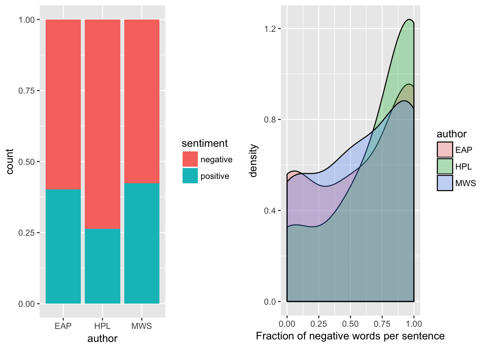

# Spring2018
# Project 1: "Some Simple SPOOKY Data Analysis"

----
This is the first and only *individual* (as opposed to *team*) this semester. 

Term: Spring 2018

+ Project title: "Some Simple SPOOKY Data Analysis"
+ This project is conducted by "Chuyuan Zhou"
+ Project summary: This files contains text mining analysis of the SPOOKY data.  The goal is to remind ourselves of some of our basic tools for working with text data in `R` and also to practice reproducibility.  You should be able to put this file in the `doc` folder of your `Project 1` repository and it should just run (provided you have `multiplot.R` in the `libs` folder and `spooky.csv` in the `data` folder).

Following [suggestions](http://nicercode.github.io/blog/2013-04-05-projects/) by [RICH FITZJOHN](http://nicercode.github.io/about/#Team) (@richfitz). This folder is organized as follows.

## Word Frequency

Now we study some of the most common words in the entire data set.  With the below code we plot the sixty most common words in the entire datset. We see that "time", "life", and "night" all appear frequently.

We can compare the way the authors use the most frequent words too.

## Data Visualization 

We'll do some simple numerical summaries of the data to provide some nice visualizations.

From the above plots we find:

* EAP is featured most frequently.

* Sentence length for EAP is more variable.

## TF-IDF

TF stands for term frequency or how often a word appears in a text and it is what is studied above in the word cloud. IDF stands for inverse document frequncy, and it is a way to pay more attention to words that are rare within the entire set of text data that is more sophisticated than simply removing stop words.  Multiplying these two values together calculates a term's tf-idf, which is the frequency of a term adjusted for how rarely it is used. 

We'll use tf-idf as a heuristic index to indicate how frequently a certain author uses a word relative to the frequency that all the authors use the word.  Therefore we will find words that are characteristic for a specific author, a good thing to have if we are interested in solving the author identification problem.

Note that in the above, many of the words recognized by their tf-idf scores are names.  This makes sense -- if we see text referencing Raymond, Idris, or Perdita, we know almost for sure that MWS is the author.  But some non-names stand out.  EAP often uses "monsieur" and "jupiter" while HPL uses the words "bearded" and "attic" more frequently than the others.  We can also look at the most characteristic terms per author.

We could also grab the top fifteen tf_idf scores in all the words for each author

# Sentiment Analysis

We will use sentences as units of analysis for this part of the tutorial, as sentences are natural languge units for organizing thoughts and ideas. For each sentence, we apply sentiment analysis using [NRC sentiment lexion](http://saifmohammad.com/WebPages/NRC-Emotion-Lexicon.htm). "The NRC Emotion Lexicon is a list of English words and their associations with eight basic emotions (anger, fear, anticipation, trust, surprise, sadness, joy, and disgust) and two sentiments (negative and positive). The annotations were manually done by crowdsourcing."

From *[Text Mining with R; A Tidy Approach](https://www.tidytextmining.com)*, "When human readers approach text, we use our understanding of the emotional intent of words to infer whether a section of text is positive or negative, or perhaps characterized by some other more nuanced emotion like surprise or disgust.  We can also use the tools of text mining to approach the emotional content of text programmatically."  This is the goal of sentiment analysis.

## The negative Index
We find:

H P Lovecraft?s texts are on average notably more negative than the author?s works: Only about 25% positive words vs around 40% for Poe and Shelley.

And also the distribution of the fraction of negative words per sentence is clearly skewed towards larger values for HPL (green) than in the case of MWS and EAP. The difference between Shelley and Poe is more subtle. The fraction of negative words in Mary Shelley?s work rises gradually toward larger values, whereas for Edgar Allan Poe is goes more into a direction of ?all or nothing?: his texts show an almost bimodal distribution with peak at low and high negativity, respectively.

## Negated negativity

## Comparing Positivity

Let's only study the "positive" words.  Note that the amount of "postive" words attributed to each author varies greatly, and the relative frequency of "positive" words to the other sentiments also varies between authors.

Now we plot a frequency comparison of these "positive" words.  Namely, we show the frequencies of the overall most frequently-used positive words split between the three authors.
 

The matrix `spooky_wrd_tm` is a sparse matrix with 19467 rows, corresponding to the 19467 ids (or originally, sentences) in the `spooky_wrd` dataframe, and 24941 columns corresponding to the total number of unique words in the `spooky_wrd` dataframe.  So each row of `spooky_wrd_tm` corresponds to one of the original sentences.  The value of the matrix at a certain position is then the number of occurences of that word (determined by the column) in this specific sentence (determined by the row).  Since most sentence/word pairings don't occur, the matrix is sparse meaning there are many zeros.

For LDA we must pick the number of possible topics.  Let's try 10, though this selection is admittedly arbitrary.
## Topic models

## Topics Terms

We note that in the above we use the `tidy` function to extract the per-topic-per-word probabilities, called "beta" or $\beta$, for the model.  The final output has a one-topic-per-term-per-row format. For each combination, the model computes the probability of that term being generated from that topic. For example, the term ???content??? has a $1.619628 \times 10^{-5}$ probability of being generated from topic 4.  We visualize the top terms (meaning the most likely terms associated with each topic) in the following.

In the above, we see that the first topic is characterized by words like "love", "earth", and "words" while the third topic includes the word "thousand", and the fifth topic the word "beauty".  Note that the words "eyes" and "time" appear in many topics.  This is the advantage to topic modelling as opposed to clustering when using natural language -- often a word may be likely to appear in documents characterized by multiple topics.

We can also study terms that have the greatest difference in probabilities between the topics, ignoring the words that are shared with similar frequency between topics. We choose only the first 3 topics as example and visualise the differences by plotting log ratios: $log_{10}(\beta \text{ of topic x }/ \beta \text{ of topic y})$. So if a word is 10 times more frequent in topic x the log ratio will be 1, whereas it will be -1 if the word is 10 times more frequent in topic y. 
In the above, the words more common to topic 2 than topic 1 are "moon", "air", and "window" while the words more common to topic 1 are "moment", "marie", and "held".

##Sentence Topics

## first and last words
we now plot the top first words for the different authors. Here the barplot scales are fixed between the facets so that the frequencies of each word can be compared for the three authors. If a bar is missing in one facet then that means that its frequency was lower than the shortest bar in this facet:

We find the fact that Edgar Allan Poe really likes to start sentences with ?the?. I also think that he and Mary Shelley like to start out with ?I?. Those are the two most frequent words for HP Lovecraft, too; but he doesn?t use them nearly as often as the other two authors.

Lovecraft does not like using ?this? and ?we? at the beginning of a sentence quite as much as the others do. In general, his distribution is flatter, suggesting a higher diversity in opening words.

We could then extract the TF-IDF informatin for the first and last word data:

And we find that

The openings ?later?, ?old?, and ?instead? are tell-tale signs of Lovecraft?s works. Poe likes to use ?meantime? and ?hereupon?, whereas Shelley prefers ?alas?. Specific character names also make an appearance here.

The presence of the word ?chapter? in Shelley?s sentences might indicate that those still contain some structuring work that we don?t have in the other author?s samples.

We could also find that:

Beyond the specific place and character names (such as ?Raymond? or ?Arkham?) there are a few interesting final words for each author: Poe has ?altogether?, ?minute?, ?antagonist? and also ?machine? which fits into his technical vocabulary.

Lovecraft?s sentences most characteristingly end on ?moonlight?, ?region?, or ?thing?. And for Shelley it?s a (Halloween-themed) roller coaster of emotions: ?misery?, ?love?, ?wretchedness?, and ?sympathy?. This is very consistent with the overall emphasis she puts on the microcosm of feelings that express the fears and struggles of her protagonists.

## Gender balance of the texts
we could  plot the difference in the frequencies of the words ?woman? vs ?man?, ?she? vs ?he?, ?her? vs ?him?, and general gender indicators for the 3 authors:

We find that:

Not much femininity in Lovecraft. Interestingly, he has (just about) the most mentions of ?woman? but not much of them seem to be doing something.

The dominance of ?her? over ?him? in Shelley?s (and Poe?s) work is remarkable. Of course, ?her? can be the counterpart of ?him? as well as ?his?, but I think that this alone can?t explain the full effect.

Perhaps unsurprisingly, Mary Shelley uses far more ?female? words than her two male counterparts. The clear differences here between Poe and Lovecraft show a promising amount of distinguishing power.

We find that the overall numbers reflect what we had seen above for the gender balance; i.e. Lovecraft rarely using ?she?. The fact that his facet for the word ?she? contains more bars than for the others is simply due to all the short bars sharing a rank with 2 occurences.

Men (or male entities) in Lovecraft?s works appear to be more associated with ?did? and ?could? rather than ?is? and ?has?, as we find it for Poe. Interestingly, ?did? and ?could? are also the terms more frequently following the word ?she? in Shelley?s work, while Poe?s top 5 includes ?must?.

Please see each subfolder for a README file.
